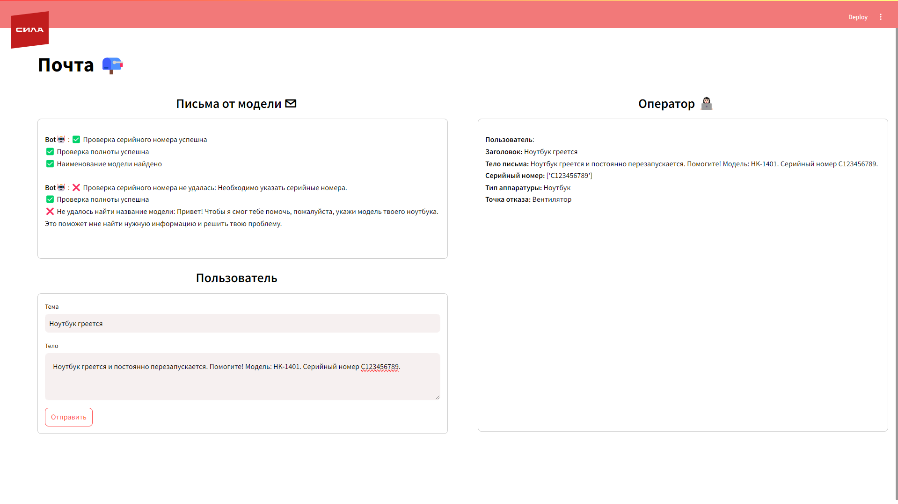

# Автоматическая диспетчеризация заявок

Запуск осуществлялся на Windows 11 (R5 5600, 32GB RAM, RTX 4060ti).

На вашем компьютере должен быть установлен docker desktop (можно скачать по ссылке https://www.docker.com/products/docker-desktop/).

0. Склонировать данный репозиторий
```
git clone https://github.com/ZotovNikita/dispatching-requests.git
```

1. Перейти в склонированную директорию
```powershell
cd dispatching-requests
```

2. Переименовать файл `.env.example` в `.env` и указать в нем свои пути `LOCAL_OLLAMA_MODELS` и `LOCAL_HUGGINGFACE_MODELS` для сохранения языковой модели, если хотите изменить пути по умолчанию

3. Собрать проект
```
docker build .
```

4. Запустить контейнеры
```
docker-compose up -d
```

5. Спуллить модель
```
docker exec -it ollama ollama pull gemma2:9b
```

## Основные точки входа в приложение, развернутое ЛОКАЛЬНО

Swagger: http://localhost:8910/docs

Frontend: http://localhost:8558/

Centrifugo: http://localhost:8822/

## Выбор инструмента для развертывания языковой модели

Выбор `Ollama` для развертыванеия и инференса LLM Gemma2 оправдан, так как этот инструмент требует меньше видеопамяти по сравнению с vLLM, что позволяет избежать нехватки ресурсов в условиях ограниченной инфраструктуры. Однако для продакшн-среды лучше использовать `vLLM`, так как он обеспечивает более высокую производительность и оптимизацию работы с большими языковыми моделями, что критично для масштабируемых приложений.

## Описание решения

Решением кейса является NLU-сервис, который при помощи технологий ИИ позволяет анализировать на информативность и полноту письма пользователей, содержащие описание неполадок, возникающих с устройствами, для оптимизации времени работы операторов первого уровня службы поддержки.

NLU-сервис имеет следующую базовую структуру:
1) модуль для классификации, который позволяет по тексту письма определять тип устройства, с которым возникла неполадка, а также точку отказа этого устройства;
2) модуль для распознавания серийного номера оборудования в тексте письма.

Помимо базового функционала, в NLU-сервисе предусмотрены дополнительные возможности по контролю полноты информации в тексте письма:
1) анализ содержания письма на предмет наличия информации о наименовании оборудования, с которым возникли неполадки, при помощи LLM;
2) контроль классификации писем при помощи LLM, которая анализирует, достаточно ли информации в письме, чтобы определить у него тип неисправного оборудования и точку отказа так, как это сделал алгоритм.

Для NLU-сервиса был реализован API, который состоит из эндпоинтов, позволяющих обращаться к моделям и анализировать сообщения.

Помимо этого, была проработана middleware архитектура, которая является промежуточным звеном между интерфейсом отправки письма от пользователя и системой контроля обращениями со стороны оператора (с целью обеспечения контроля писем, которые поступают от пользователей операторам). Было определено, что архитектура состоит из следующих компонент:
1) NLU-сервиса, который реализует логику по обработке писем и их фильтрации;
2) распределительного сервиса, который инициирует работу NLU-сервиса и принимает решения по подтверждению/отклонению писем;
3) сервиса по обмену сообщениями между компонентами middleware.

Для демонстрации работы данного подхода была реализована графическая часть, разработанная при помощи библиотеки Streamlit, позволяющая продемонстрировать базовый функционал по работе данной системы.


